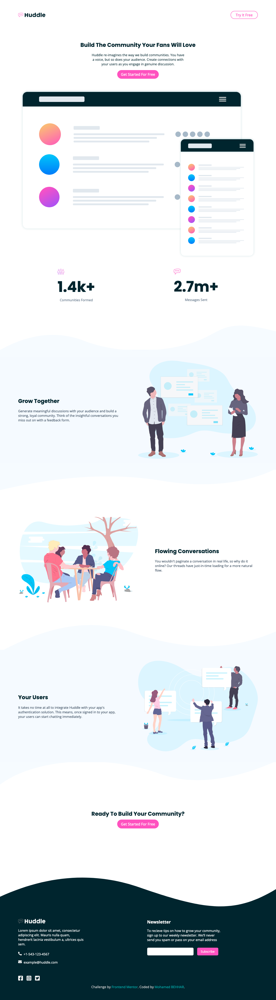

# Frontend Mentor - Landing page with curved section Solution

## Table of contents

- [Overview](#overview)
  - [The challenge](#the-challenge)
  - [Links](#links)
  - [Screenshot](#screenshot)
  - [Built with](#built-with)
- [Author](#author)

## Overview

### The challenge

Users should be able to:

- View the optimal layout for the site depending on their device's screen size
- See hover states for all interactive elements on the page

### Links
- Live Site URL: [click-me]( https://mohamedbehhar.github.io/Landing-page-with-curved-section/)

### Screenshot
- Desktop

- Mobile

### Built with

- Semantic HTML5 markup
- CSS custom properties
- Flexbox
- CSS Grid
- Mobile-first workflow

## Author

- Frontend Mentor - [@MohamedB ehhar](https://www.frontendmentor.io/profile/MohamedBehhar)
- Github - [@Mohamed Behhar](https://github.com/MohamedBehhar)
